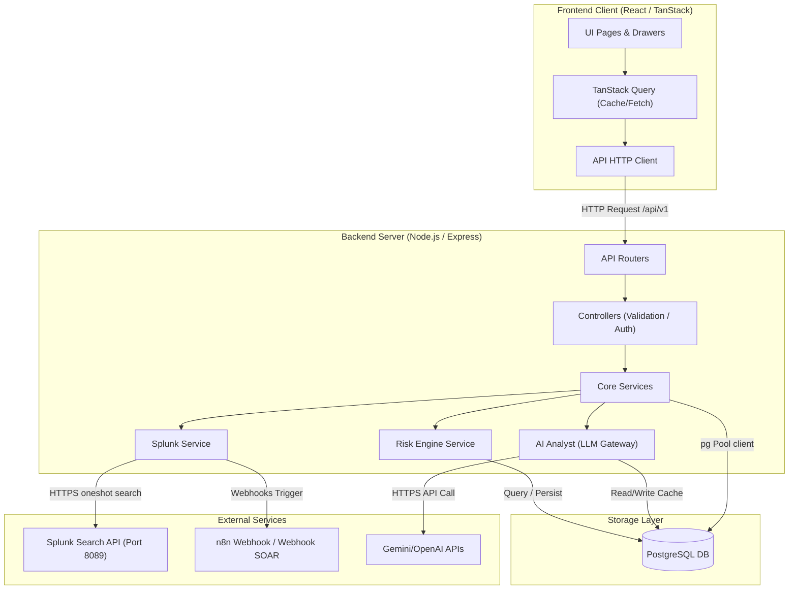

# SOCVision AI — Architecture Design

This document details the high-level architecture, subsystem components, data flows, and workflow integrations of the SOCVision AI platform.

---

## High-Level Architecture Diagram



---

## Frontend Architecture

The frontend is built using **TanStack Start** with a React rendering layer. It is fully client-side driven and communicates asynchronously with the backend API.
* **Routing Layer (`src/routes/`)**: Managed by TanStack Router, ensuring type-safe route paths and clean layout nesting. The AI Analyst queue supports state-binding through route search queries (`?alertId=UUID`), enabling back-button history and shared link state.
* **State & Query Layer (`src/hooks/`)**: Implements TanStack Query (`useQuery`, `useMutation`). Query caching is set up to match page polling configurations:
  * Alerts check every 10 seconds.
  * Incidents check every 15 seconds.
  * AI analysis results are cached with a `staleTime` of 10 minutes (`600000` ms) to prevent redundant LLM generation triggers.
* **Styles**: Styled using custom, responsive Vanilla CSS variables (`index.css`), providing fluid micro-animations, glassmorphism card visual overlays, and color mappings.

---

## Backend Architecture

The backend is a Node.js Express server structured into functional features and logical layers:
* **Route Bindings (`src/routes/` and `src/modules/*/routes`)**: Map URL patterns directly to controller handlers, checking input schemas using Zod validation middleware.
* **Controllers (`src/controllers/` and `src/modules/*/controllers`)**: De-serialize request parameters, validate headers, and orchestrate service calls. Wrap responses in consistent JSON envelopes (`success: true, data: T, meta: ResponseMeta`).
* **Services (`src/services/` and `src/modules/*/services`)**: Contain the core business logic (Splunk searches, LLM prompts parsing, risk scoring matrices).
* **Database Connection (`src/config/database.ts`)**: Uses `pg.Pool` with automatic UTC timezone initialization on connection. Implements a health checker monitored by the `/health` readiness routes.

---

## Database Architecture

A single PostgreSQL database holds all configuration, detections, and caching. Major tables include:
1. **`users`**: Security analysts profiles (Tier 1-3) and authentication properties.
2. **`alerts`**: Normalized security events from external systems (Splunk, Wazuh). Stores risk score calculations, MITRE coverage mappings, and raw JSON logs payloads (`JSONB`).
3. **`incidents`**: Local tickets grouped under status tags (OPEN, INVESTIGATING, RESOLVED, CLOSED).
4. **`incident_alerts`**: Many-to-many junction table mapping which alerts are linked to which incident ticket.
5. **`incident_comments`**: Notes timeline attached to incidents.
6. **`risk_scores`**: Calculated threat scores log database. Stores factor break-downs (user modifier, frequency modifier, asset type weight) to track security posture deltas.
7. **`ai_analysis`**: Caches LLM-generated incident reviews by `alert_id` to prevent redundant external LLM requests.

---

## Core Flows & Workflows

### 1. Splunk Integration Flow
```text
[Threat Hunting UI] ──(Search request)──> [GET /splunk/events]
                                                  │
                                          (Check Simulation Mode)
                                            ├── False ──> [Axios POST /services/search/jobs] ──> [Splunk Server]
                                            └── True  ──> [Return simulated events array]
```

### 2. Risk Engine Flow
When a new alert is created, the Risk Engine computes a multi-factor score:
$$\text{Risk Score} = \text{Base Score} \times \text{User Weight} \times \text{Asset Weight} \times \text{Frequency Factor}$$
* If the computed score $\ge 80$, the system automatically spawns a local incident ticket and links the alert.
* Calculations are persisted to the `risk_scores` history table.

### 3. Incident Workflow
1. **Spawn**: Generated automatically by the Risk Engine ($\text{score} \ge 80$) or manually by an analyst.
2. **Assign**: Associated with a lead analyst user ID.
3. **Triage**: Analysts write comment updates on the ticket, which are saved to `incident_comments`.
4. **Close**: When resolved, the incident status updates to `CLOSED`, auto-logging an audit record to `audit_logs`.

### 4. AI Analyst Workflow
```text
[Analyst Triage UI] ──(Queries report)──> [GET /ai/analyze/:alertId]
                                                  │
                                       (Look up in DB: ai_analysis)
                                                  │
                            ┌─────────────────────┴─────────────────────┐
                            ▼ Found                                     ▼ Not Found
                   [Return cache in 9ms]                 [Display Generating Progress Skeleton]
                                                                        │
                                                             [Build prompt with risk/logs]
                                                                        │
                                                              [Gemini API generation]
                                                                        │
                                                             [Write to DB: ai_analysis]
                                                                        │
                                                             [Render Complete Report]
```

### 5. MITRE ATT&CK Mapping Workflow
* The backend AI service returns a list of matched technique IDs (`T1059.001`, `T1078`) based on the rule ID and alert title.
* The frontend aggregates the alert collection client-side, grouping active detections under standard MITRE tactic columns (Initial Access, Execution, Persistence, Defense Evasion, etc.).
* Technique boxes in the matrix calculate their threat heatmap color based on the number of alerts mapped. Clicking a cell displays related alerts and the corresponding LLM summaries.
