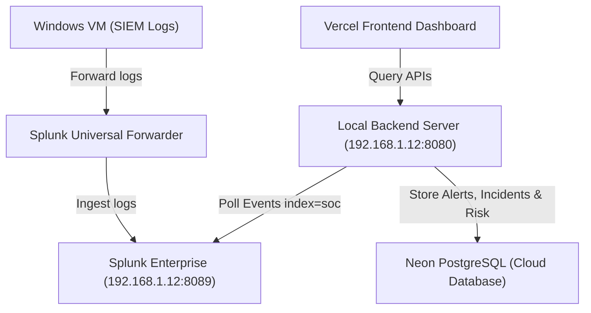

# SOCVision AI Local SOC Mode Deployment Guide

This guide describes how to configure and execute SOCVision AI in **Local SOC Mode** where the backend runs locally on your workstation to maintain direct, secure access to your private Splunk Enterprise instance.

## Architecture Diagram



---

## 1. Network & Port Requirements
* **Splunk Management API**: Port `8089` (inbound connections must be enabled on the Splunk host machine firewall).
* **Local Backend API**: Port `8080` (must be accessible from the public internet if Vercel hosts the frontend, or locally if running a local frontend).
  > [!NOTE]
  > Because the frontend is hosted on **Vercel** (`https://soc-vision-ai.vercel.app`), Vercel's public edge servers must be able to query the backend at `http://192.168.1.12:8080/api/v1`. 
  > To enable this, configure port forwarding on your local router (forward port `8080` to `192.168.1.12`), or use a proxy tunnel like Cloudflare Tunnel or Ngrok.

---

## 2. Configuration Setup

### Backend Environment Configuration (`backend/.env`)
Ensure your `backend/.env` file contains the following environment variables:
```ini
PORT=8080
HOST=0.0.0.0

# Database
DB_HOST=localhost # or your Neon PostgreSQL hostname
DB_PORT=5432
DB_NAME=socvision
DB_USER=postgres
DB_PASSWORD=your_password

# Splunk Enterprise Settings
SPLUNK_URL=https://192.168.1.12:8089
SPLUNK_INDEX=soc
SPLUNK_USERNAME=abhi
SPLUNK_PASSWORD=Abhi961@
SPLUNK_SIMULATION_MODE=false
```

### Frontend Configuration (`frontend/.env`)
Set the environment variables for your Vercel deployment:
```ini
VITE_API_URL=http://192.168.1.12:8080/api/v1
```

---

## 3. Operations & Startup

### Start Local Backend
Run the batch file in the root of the workspace:
```cmd
start-backend.bat
```
This launches the backend compiler watcher and binds the API server to `http://0.0.0.0:8080`.

### Verify Splunk & Database Status
Run the verification batch file:
```cmd
verify-splunk.bat
```
This script tests database pool connections, executes sample search jobs on Splunk Enterprise `index=soc`, and reports active alert count statistics.
