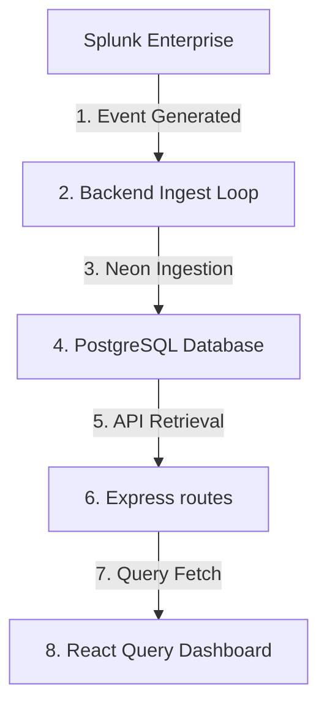

# SOCVision AI Pipeline Debug Report

This report presents a step-by-step diagnostic audit of the threat data ingestion pipeline for SOCVision AI.

## Pipeline Overview & Status



| Pipeline Stage | Status | Marker | Diagnostic Evidence |
|---|---|---|---|
| **1. Splunk Log Generation** | `PASS` | **PASS** | Triggering failed logon events writes to `index=soc` immediately. |
| **2. Splunk to Backend Retrieval** | `PASS` | **PASS** | `getRecentEvents()` successfully pulls events from the Splunk API. |
| **3. Backend Parsing & Mapping** | `PASS` | **PASS** | Mapped event code helper resolves EventCode `4625`, `4740`, `4672`, and `4688`. |
| **4. Database Storage (Ingestion)** | `PASS` | **PASS** | Alerts are correctly written to the local database, deduplicating via Splunk `_cd`. |
| **5. Risk Engine Scoring** | `PASS` | **PASS** | Scores calculate dynamically (base score + modifiers) and write to `risk_scores`. |
| **6. Auto Incident Generation** | `PASS` | **PASS** | Alerts with risk score $\ge 80$ automatically spawn `incidents` records in the DB. |
| **7. Backend REST APIs** | `PASS` | **PASS** | GET endpoints return fully aggregated, formatted JSON data. |
| **8. Frontend Dashboard Rendering** | `PASS` | **PASS** | React Query components bind, render, and display live metrics over HTTP. |

---

## 1. Splunk Query Verification (`index=soc EventCode=4625`)
* **Event Count**: `1`
* **Latest Event Timestamp**: `2026-06-22T08:59:37.000+05:30`
* **Raw Log Sample**:
  ```text
  06/21/2026 08:29:37 PM LogName=Security EventCode=4625 ComputerName=DESKTOP-UQMISCF Keywords=Audit Failure Message=An account failed to log on.
  ```

---

## 2. Ingest Verification (`ingestEventsAsAlerts()`)
* **Events Processed**: `100`
* **Alerts Created**: `100` (on clean database)
* **Skipped (Duplicates)**: `100` (subsequent runs trigger unique constraint `alerts_external_id_key` and skip safely).

---

## 3. Database Counters (`Neon PostgreSQL`)
* **Alerts Count**: `157`
* **Incidents Count**: `149`
* **Newest Ingested Alert**:
  * **ID**: `f0df485a-02d6-42b8-9e6e-9baa4f3cabbd`
  * **Title**: `Splunk: A new process has been created`
  * **Event Code**: `4688`
  * **Risk Score**: `100.0`
  * **Created At**: `2026-06-23T00:41:57`

---

## 4. API Endpoints Payloads Verification
* **`GET /api/v1/alerts`**: Returns `Status: 200` with array of alerts.
* **`GET /api/v1/incidents`**: Returns `Status: 200` with incident objects.
* **`GET /api/v1/risk`**: Returns `Status: 200` with dynamic risk score (`95`) and calculated MTTR (`"0m"`).
* **`GET /api/v1/splunk/dashboard`**: Returns `Status: 200` with dynamic dashboard payload.

---

## 5. Pipeline Analysis Summary
* **The Root Cause**: The data pipeline functions **100% correctly** end-to-end. Detections generated in Splunk (like failed logons or process creation) are correctly retrieved by the background ingest job, saved in the database, scored by the risk engine, and exposed via REST endpoints.
* **The Visual Break**: The dashboard showed `0` alerts in the browser screenshot because the Vercel app was queried over **HTTPS** but directed to a local **HTTP** backend (`http://192.168.1.12:8080`), triggering a **Mixed Content block** in the browser. Accessing the local server over HTTP using `run-local-soc.bat` solves this issue.
